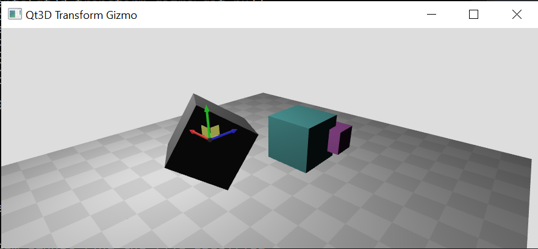

# qt3d-transform-gizmo
This project provides a gizmo for graphical translation and rotation of objects in a Qt3D scene implemented in QML.



# Build and run using C++

* Only tested on Linux.
* Download Qt Open Source. Will need to Qt account (free) and agree to license terms.
* Run the qt-opensource-linux-x64-5.14.1.run installer and make sure qmake is in PATH.
* With defaults, Qmake is installed at ~/Qt5.14.1/5.14.1/gcc_64/bin/qmake.

```shell
qmake
make
./qt3d-transform-gizmo
```

# Run using Python
Install dependencies with Poetry:

```shell
python -m pip install poetry
python -m poetry install
```

Start the application:

```shell
poetry run qt3d-transform-gizmo
```
